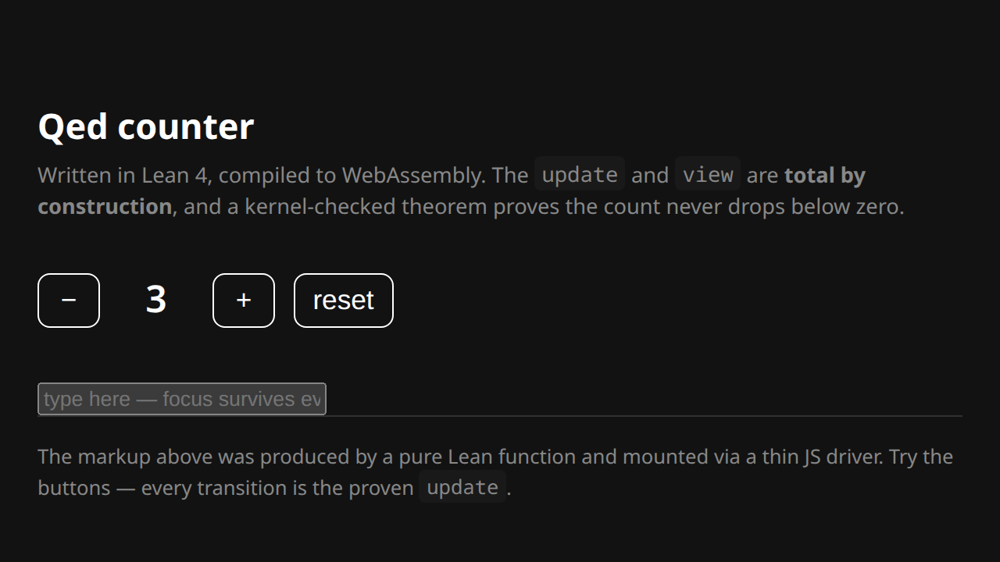

# Qed

**A formally-verified web frontend framework in Lean 4.**

Qed apps compile to WebAssembly and run in the browser, and because the code is
*Lean*, the running artifact carries machine-checked guarantees:

- **Total by construction.** Every `update` and `view` is an ordinary Lean
  function, so it is proven terminating and exhaustive *to compile*. Runtime
  crashes, non-exhaustive matches, and infinite render loops are rejected before
  the app ever builds.
- **Theorems about your app, discharged for you.** State a property; the
  framework generates and the kernel checks the proof. The counter below proves
  its count never drops below zero, with **no hand-written proof** — and the
  theorem depends only on Lean's core axioms (`propext`, `Quot.sound`), never
  `sorry`.

The design rule is *outside-in*: start from the most readable, maximally-proven
Lean a developer would want to write, then build whatever elaboration machinery
(macros, `deriving`, refinement types, proof automation) makes that surface real.
The macros and notation elaborate into that small typed core, so they don't change
what is proven.

## Install

```bash
curl -sSfL https://raw.githubusercontent.com/JacobAsmuth/qed/main/install.sh | sh
qed new myapp && cd myapp && qed dev
```

The installer adds elan (the Lean toolchain manager) if it's missing, fetches the
framework into `~/.qed`, builds the `qed` CLI, and puts it on your PATH. The wasm
toolchain and emscripten are fetched on first `qed build`, not at install time.

## The counter, in full

```lean
import Qed
open Qed

structure Model where
  count : Int
deriving Repr, Inhabited

inductive Msg | increment | decrement | reset
deriving Repr

def init : Model := { count := 0 }

def update (m : Model) : Msg → Model
  | .increment => { m with count := m.count + 1 }
  | .decrement => { m with count := if 0 < m.count then m.count - 1 else m.count }
  | .reset     => { m with count := 0 }

def view (m : Model) : Html Msg :=
  div [cls "counter"] [
    button [onClick .decrement] [text "−"],
    span   [cls "count"]        [text (toString m.count)],
    button [onClick .increment] [text "+"],
    button [onClick .reset]     [text "reset"]
  ]

def app : App Model Msg := sandbox init update view

-- State the safety property; the framework proves it for every transition.
invariant counterSafe : (fun m => 0 ≤ m.count) preserved_by update
```

That's the whole app. `lake build` checking it green *is* the proof that it is
total and that `counterSafe` holds.



## Proven building blocks

Beyond the runtime, Qed ships verified pieces for the things frontends actually
do. Each states a spec and the framework discharges the proof — you never write
one by hand. (Axioms below are all sound Lean foundations; none use `sorry`.)

**Verified VDOM diff/patch** (`Qed/Diff.lean`). The incremental update path is
proven identical to a full re-render, so the DOM can never drift from your view:

```lean
theorem diff_apply (a b : Html msg) : applyPatch (diff a b) a = b
```

**JSON** (`Qed/Json.lean`). The full grammar — objects, arrays, strings (with
escapes incl. `\uXXXX`), and exact numbers (`JsonNumber`) — nested to any depth.
Termination is free (structural recursion on a fuel counter), and the
developer-chosen depth bound is a theorem:

```lean
def parse (s : String) (maxDepth : Nat := 64) : Except String Json
theorem parse_depth_le : parse s maxDepth = .ok j → j.depth ≤ maxDepth
-- and the codec round-trip, proven for the structural core (null/bool/nested arrays):
theorem parse_render : j.Simple → j.depth ≤ maxDepth → parse (render j) maxDepth = .ok j
```

Typed encode/decode is one line per type via a core-syntax macro (no `import
Lean`, so no elaborator in the WASM binary):

```lean
structure User where name : String; age : Nat; address : Address; tags : List String
jsonCodec User [name, age, address, tags]   -- ToJson + FromJson; nested structs work
```

**Round-tripping routes** (`Qed/Router.lean`). The round-trip law is a *field of
the `Router` class*, so an instance cannot exist without it — no route is
unreachable, no URL fails to parse back:

```lean
inductive Route | home | about | post (slug : String) | user (name : String)
theorem Route.round_trip (r : Route) : parse (print r) = some r   -- by `cases r <;> simp`
```

**Forms where submit-enabled ⇔ valid** (`Qed/Form.lean`). Fields are refinement
types (a value carries its proof of validity), so an invalid form is
unrepresentable and the submit gate *is* the validity decision:

```lean
structure Signup where               -- can only be built from valid input
  email : Refined isEmail
  age   : Refined isAdult
theorem Signup.canSubmit_iff : canSubmit email age = true ↔ isEmail email ∧ isAdult age
```

## Example: loading data into a typed model

A page that loads a user from an API and tracks its current route:

```lean
inductive Route | home | profile (name : String) deriving DecidableEq, Repr

structure User where name : String; age : Nat; tags : List String
jsonCodec User [name, age, tags]              -- one line: ToJson + FromJson

structure Model where
  route : Route
  user  : Option User                         -- decoded, or not loaded yet

inductive Msg
  | navigate (to : Route)
  | apiResult (body : String)                 -- a raw fetch response body

def update (m : Model) : Msg → Model
  | .navigate to    => { m with route := to }
  | .apiResult body => { m with user := (Json.parse body >>= fromJson).toOption }
```

No proof is written, but `lake build` rejects this unless `update` handles every
`Msg` and terminates, `Json.parse` is depth-bounded for any `body`, `fromJson` is
total, and nothing uses `sorry`.

## What this lets you prove

Each property below is checked by `qed check`, with no hand-written proof:

- **Diff equals re-render** — `applyPatch (diff a b) a = b` (`Qed/Diff.lean`).
  Untouched nodes keep their focus, scroll, and input state.
- **Parser depth bound** — `parse s maxDepth = .ok j → j.depth ≤ maxDepth`
  (`parse_depth_le`), for any input.
- **JSON round-trip** — `parse (render j) = .ok j` on the structural core (`parse_render`).
- **URL round-trip** — `parse (print r) = some r` (`Route.round_trip`); the law is a
  field of the `Router` class, so an instance can't omit it.
- **Submit ⇔ valid** — `canSubmit e a = true ↔ isEmail e ∧ isAdult a` (`canSubmit_iff`).
- **Totality** — `update`/`view` have no `panic`, no missing case, no infinite loop.
- **State-machine invariant** — `invariant p preserved_by update` proves `p` holds
  after every message.

## How it works

```
Lean app (Model, Msg, update, view, deriving/invariant — proofs auto-discharged)
   │  lake build         (Lean → C, in .lake/build/ir/*.c)
   ▼
emcc  (app C  +  runtime/qed_dom.c [EM_JS DOM shims]  +  prebuilt Lean wasm runtime)
   ▼
runtime/qed.js (MODULARIZE factory) + qed.wasm
   ▼
runtime/host.js:  qed_run_init() mounts;  DOM event → qed_run_dispatch(id)
                  → pure `update` → diff vs. previous view → patch only what changed
```

On each event the new view is diffed against the previous one and only the
changed nodes are patched — so the proven `diff_apply` theorem (see below)
guarantees the DOM equals the new view, while untouched nodes keep their identity
(focus, cursor, scroll, selection all survive an update).

The only impure, unverified surface is `Qed/Dom.lean` (a handful of `@[extern]`
node primitives) and its C/JS implementation in `runtime/`. Everything above that
line is pure, total Lean. Events cross back by id and are looked up totally
(`Array.get?`), so a bad event id can never crash the app.

## The `qed` CLI

The toolchain is a single command with a vocabulary web devs already know.
Verification runs as part of every `build`/`dev`/`check`: the Lean kernel checks
your proofs (a failed proof is a build error), the sources are grepped for
`sorry`/`admit`/`native_decide`, and the axiom manifest is run.

```bash
qed dev        # watch sources, rebuild, serve with live-reload  → localhost:8000
qed build      # production build → dist/ (optimized + verified)
qed start      # serve the build            (alias: preview)
qed test       # browser test suite (if present)
qed check      # verify only: proofs + no-sorry + axiom-clean, no artifacts
qed clean      # remove build outputs
qed new APP    # scaffold a new app
qed doctor     # report which dependencies are present
```

`npm run dev` / `build` / `test` / … work too (see `package.json`) for muscle
memory. When hacking on the framework itself, the in-repo `./qed` shim runs the
CLI against this checkout.

## Layout

| Path | What |
|------|------|
| `Qed/Html.lean` | The core typed virtual DOM — the elaboration target. |
| `Qed/Notation.lean` | Readable view combinators (`div`, `button`, `onClick`, …). |
| `Qed/Runtime.lean` | The Elm Architecture (`App`, `sandbox`) + pure render-to-HTML. |
| `Qed/Invariant.lean` | The `invariant … preserved_by …` command (auto-proven). |
| `Qed/Diff.lean` | The diff/patch engine + the `diff_apply` correctness proof. |
| `Qed/Json.lean` | Full JSON parser/renderer + typed `jsonCodec` + `parse_depth_le` & `parse_render` proofs. |
| `Qed/Router.lean` | The `Router` class (round-trip law as a field) + a route table. |
| `Qed/Form.lean` | Refinement-typed forms + the `canSubmit_iff` proof. |
| `Qed/Dom.lean` | The `@[extern]` DOM node primitives (the trusted boundary). |
| `Qed/Driver.lean` | The impure browser driver (build + patch) + `@[export]`ed entry points. |
| `Examples/Counter.lean` | The demo app (shared by both entry points). |
| `Examples/Native.lean` / `Examples/Web.lean` | Native / WASM entry points. |
| `Cli.lean` + `./qed` | The toolchain (build/dev/test/check/…) and its shim. |
| `runtime/` | C/JS driver, page, dev server. |
| `scripts/axioms.lean` | Axiom manifest gated by `qed check`/`qed build`. |

## Notable constraints

- **Lean is pinned to v4.15.0** — it is the *last* release that ships the
  prebuilt `linux_wasm32` toolchain (v4.16+ dropped it), which supplies the Lean
  runtime already compiled for wasm so we never build it ourselves.
- **`runtime/uv_stubs.c`** defines four libuv temp-file symbols that `libleanrt`
  references but the wasm toolchain doesn't bundle. A frontend never calls them;
  the stubs keep the linker strict.
- The WASM build is **emscripten, not WASI** (Lean uses C++ exceptions) and uses
  `-pthread`, so the page must be served cross-origin-isolated (see `serve.py`).

## Roadmap

**Done** (all kernel-checked, `sorry`-free — run `./qed check`):
the verified core, an end-to-end browser slice, the verified diff/patch engine,
state-machine invariants, full-grammar JSON (parser + renderer + typed codec +
depth bound + codec round-trip on the structural core), round-tripping routes,
and refinement-typed forms.

**Next:**

- **Extend the JSON codec round-trip** — `parse_render` covers null/bool/nested
  arrays today; extending it to numbers, strings, and objects needs an integer
  `toString`/parse-inverse lemma and a string escape-inverse lemma.
- **`Cmd`-based effects** — async/data-fetching as data, so `update` stays pure
  and total: `update : Model → Msg → Model × Cmd Msg`, with the JS driver
  interpreting fetch/timer commands.
- **Keyed reconciliation** — extend the diff proof to matched/moved children (the
  current proof is exact for positional children).
- **`deriving Router` / `deriving Form`** — generate the instances above from the
  type alone, so even the boilerplate disappears (the proofs already auto-discharge).
