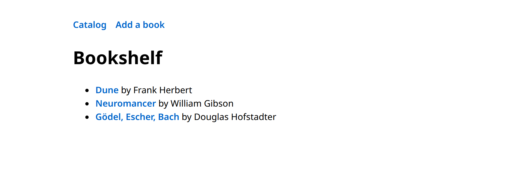

# Qed

**A web framework with compile-time checks for UI rules.**

Qed is a web framework for [Lean 4](https://lean-lang.org) with JSX-style components,
local state, live props, and typed events. State invariants describe rules that updates must
preserve. Qed can prove many simple invariants automatically; more involved ones may need
a handwritten proof.

- **State checks.** Compilation fails if Qed cannot prove an invariant. The error message
  includes the action and the remaining proof goal.
- **Forms and JSON.** From one schema, Qed generates the draft, form,
  validated type, and functions for reading and writing JSON.
- **DOM updates.** For bindings it can track, Qed updates text and attributes
  directly. It uses a DOM diff for changes such as adding or reordering rows.
- **JavaScript output.** Builds produce a client bundle and can generate a handler for server
  rendering. The proofs don't run in the browser, and it needs no Lean or WASM runtime.

[Get started](#get-started) · [Styling invariants](#styling-invariants) · [Example tour](Examples/README.md)



Bookshelf includes a catalog, book detail pages, and an add-book form. [Run instructions](Examples/README.md#bookshelf).

## State rules

`qed new` creates this `App.lean`: a quantity picker with a rule that its value stays
between one and ten.

```lean
import Qed
open Qed

component Quantity where
  state quantity : Int := 1
  action increase when (quantity < 10) => set quantity (quantity + 1)
  action decrease when (1 < quantity) => set quantity (quantity - 1)
  view =>
    <div>
      <button onClick={.decrease}>−</button>
      <span>{quantity}</span>
      <button onClick={.increase}>+</button>
    </div>

invariant quantityInRange :
  (fun s => 1 ≤ s.quantity ∧ s.quantity ≤ 10)
  preserved_by Quantity.update
```

Qed generates `Quantity.update` from the component's actions. The invariant is checked
against every branch of that function, including any actions added later.

If you removed the lower bound guard from decrease, the compiler would report:

```text
invariant `quantityInRange` isn't preserved by `Quantity.update`
case `decrease` still needs: 1 ≤ m.quantity - 1 ∧ m.quantity - 1 ≤ 10
```

The proof covers `Quantity.update`. Qed's JavaScript compiler and browser code are tested
separately and can still have bugs. [More about the checks](docs/architecture.md).
You can write components without invariants and add rules as you need them.

## Forms and validation

```lean
schema Order where
  name : Codec.text.refine (fun s => s.length ≥ 1)
  quantity : Codec.nat.refine (fun n => 1 ≤ n ∧ n ≤ 10)
  acceptTerms : Codec.checkbox.refine (· = true)
```

Qed generates `Order.Draft` for editable input, including incomplete or invalid values.
`Order.parse` returns `Option Order`; each refined field in a valid `Order` includes a proof
that its rule is satisfied. The generated JSON decoder applies the same rules.

The generated form uses that draft (`m.draft : Order.Draft`):

```lean
{Order.formView m.draft .edit .submit}
```

Submit is disabled until the schema is valid. A parsed order can be serialized with
`Order.encode`, without a separate form-to-payload conversion.
[Signup](Examples/Signup.lean) shows a complete form;
[Booking](Examples/Booking.lean) adds a date rule that depends on today's date.

## Styling invariants

```lean
def enabledStyle : Style := css
  [backgroundColor (hex "2563eb"), color (hex "fff"), cursor "pointer"]

def disabledStyle : Style := css
  [backgroundColor (hex "e5e7eb"), color (hex "6b7280"), cursor "not-allowed"]

inductive Msg | save

def saveButton (enabled : Bool) : Html Msg :=
  <div>
    {styleSheet [enabledStyle, disabledStyle]}
    <button disabled={!enabled} onClick={.save}
      {if enabled then enabledStyle else disabledStyle}>Save</button>
  </div>

invariant saveButtonStyled :
  tagHasOneOf "button" [enabledStyle, disabledStyle]
  holds_in saveButton
```

Each `css` definition produces a scoped class; `styleSheet` includes its CSS in the view.
The invariant checks that every button rendered by `saveButton` has `enabledStyle` or
`disabledStyle`, for both values of `enabled`. If a branch returned an unstyled button,
the compiler would report a failed styling invariant.

The [invariant guide](docs/invariants.md#styling-invariants-over-the-view) covers more styling
rules, including relationships between elements. [Feed](Examples/Feed.lean) applies a styling
invariant to every card in a list.

## Get started

Use Bash, Git, and curl for the installer, plus a Node.js version with `fetch`, `Request`,
and `Response` for SSR. The installer sets up elan (Lean's toolchain manager) if needed,
downloads the framework into `~/.qed`, and builds the CLI. The first build also downloads
the pinned Lean toolchain.

```bash
curl -sSfL https://raw.githubusercontent.com/JacobAsmuth/qed/main/install.sh | bash
export PATH="$HOME/.elan/bin:$HOME/.qed/bin:$PATH"
qed new myapp
cd myapp
qed dev
```

The app runs at **http://localhost:8000**. **`App.lean`** contains the quantity picker;
`qed dev` rebuilds and reloads the page when the source changes. **`Web.lean`** is the browser
entry, calling `Qed.run Quantity.app`.

A failed proof stops the rebuild. The dev server continues to serve the last successful build.
In a Lean editor, `\le` inserts `≤` and `\and` inserts `∧`; `<=` also works for `≤`.

```bash
qed check      # compile proofs and run source/manifest checks
qed build      # production client bundle + SSR handler → dist/
qed start      # serve dist/ with SSR (alias: qed preview)
qed doctor     # inspect local dependencies
```

The build also works as a static single-page app. For SSR integration, the generated
`dist/ssr.mjs` exports an async `(Request) => Response` handler.
[Development and deployment details](docs/architecture.md) cover APIs, state restoration,
and verification. `qed test` runs a project's browser tests when present; `qed clean` removes
build outputs. This repository provides `npm run dev`, `build`, and `test` aliases;
newly scaffolded apps use the `qed` commands directly.

## Learn more

- [Components](docs/components.md): actions, live props, local state, and child collections.
- [Invariants](docs/invariants.md): automatic proofs, supplied proofs, and collection contracts.
- [How Qed works](docs/architecture.md): how builds work, what the proofs cover,
  deployment, and where to find the code.
- [Rendering](docs/rendering.md): direct updates, reconciliation, benchmarks, and browser checks.
- [Example tour](Examples/README.md): from a first component to forms, streaming, and SSR.

Qed apps are written in Lean, including the expressions inside JSX. Familiar component
concepts help you get started, but using it means learning Lean syntax and, for more involved
properties, proof techniques. JavaScript integration uses [typed ports](Examples/Effects.lean).

Questions and issues: [GitHub issues](https://github.com/JacobAsmuth/qed/issues).

## License

MIT. See [LICENSE](LICENSE).
